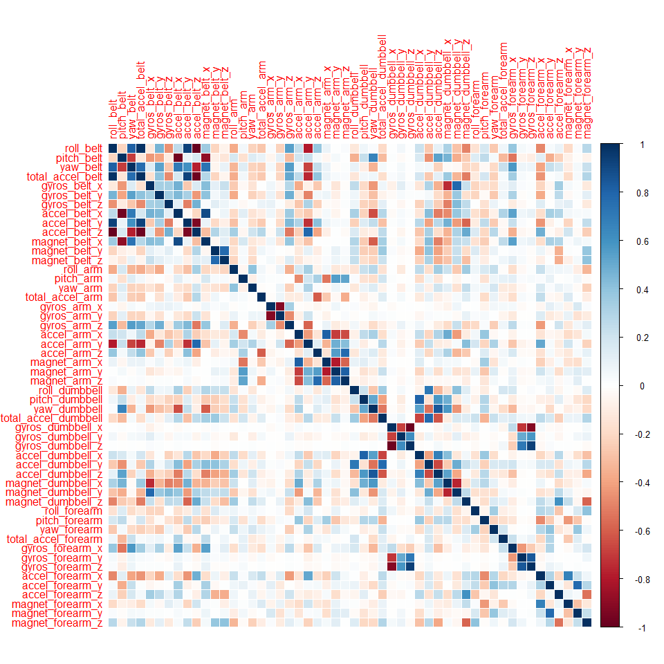

# Practical Machine Learning: Prediction Assignment Writeup
Created by H.Wang on December 23, 2015

## Introduction
Using devices such as Jawbone Up, Nike FuelBand, and Fitbit it is now possible to collect a large amount of data about personal activity relatively inexpensively. These type of devices are part of the quantified self movement - a group of enthusiasts who take measurements about themselves regularly to improve their health, to find patterns in their behavior, or because they are tech geeks. One thing that people regularly do is quantify how much of a particular activity they do, but they rarely quantify how well they do it. In this project I will use data from accelerometers on the belt, forearm, and dumbell of 6 participants, who were asked to perform barbell lifts correctly and incorrectly in 5 different ways, to predict how good they did the exercise. 

## Initialization 

```r
library(caret)
library(rpart)
library(rpart.plot)
library(randomForest)
library(corrplot)
```

## Data Analysis 

```r
#Set Up Directory
setwd("~/R/Coursera/Practical Machine Learning")

train_url <- "https://d396qusza40orc.cloudfront.net/predmachlearn/pml-training.csv"
test_url <- "https://d396qusza40orc.cloudfront.net/predmachlearn/pml-testing.csv"

#Download Raw Data
if (!file.exists("./raw_data")){
  dir.create("./raw_data")
}
if (!file.exists("./raw_data/pml-training.csv")){
  download.file(train_url, destfile = "./raw_data/pml-training.csv", method = "libcurl")
}
if (!file.exists("./raw_data/pml-testing.csv")){
  download.file(test_url, destfile = "./raw_data/pml-testing.csv", method = "libcurl")
}

#Getting and Cleaning Data
traindata <- read.csv("./raw_data/pml-training.csv")
testdata <- read.csv("./raw_data/pml-testing.csv")

traindata <- traindata[, colSums(is.na(traindata)) == 0] # remove NA columns
testdata <- testdata[, colSums(is.na(testdata)) == 0] # remove NA columns

traindata <- traindata[,!grepl("^X|timestamp|window", names(traindata))] # remove unnecessary columns
classe <- traindata$classe # keep classe column 
traindata <- traindata[, sapply(traindata, is.numeric)]
traindata$classe <- classe
testdata <- testdata[,!grepl("^X|timestamp|window", names(testdata))] # remove unnecessary columns
testdata <- testdata[, sapply(testdata, is.numeric)]
```
After data cleanse, the training data remains with 19622 obs. of 53 variables and testing data remains with 20 obs. of 53 variables. The only difference is the last column, in training data set it's `classe` while in testing data set it's `problem_id`.

## Data Slice
The purpose here is to split training data into two part, one is validation data set (30%) the other is pure training data set (70%). The validation part will be used to conduct cross validation in following steps.

```r
set.seed(19622)
p_traindata <- createDataPartition(traindata$classe, p = 0.70, list = F) #partitioned based on classe types 
traindata_pur <- traindata[p_traindata, ] 
traindata_val <- traindata[-p_traindata, ]
```

## Data Modeling
The predictive model for activity recognition is using **RandomForest** algorithm because it will select important variables and correlate covariates & outliers automatically. I will use **5 fold Cross Validation** when applying the algorithm. 

```r
controlRf <- trainControl(method = "cv",5) # 5 fold cross validation 
modelRf <- train(classe ~ ., data = traindata_pur, method = "rf", trControl = controlRf, ntree = 250) 
modelRf
```

```
## Random Forest 
## 
## 13737 samples
##    52 predictor
##     5 classes: 'A', 'B', 'C', 'D', 'E' 
## 
## No pre-processing
## Resampling: Cross-Validated (5 fold) 
## Summary of sample sizes: 10990, 10989, 10991, 10989, 10989 
## Resampling results across tuning parameters:
## 
##   mtry  Accuracy   Kappa      Accuracy SD  Kappa SD   
##    2    0.9906088  0.9881192  0.002409253  0.003048832
##   27    0.9903906  0.9878448  0.002696687  0.003411413
##   52    0.9832559  0.9788183  0.004929153  0.006234325
## 
## Accuracy was used to select the optimal model using  the largest value.
## The final value used for the model was mtry = 2.
```

```r
# evaluate the performance of the model on the validation data set
predictRf <- predict(modelRf, traindata_val)
confusionMatrix(traindata_val$classe, predictRf)
```

```
## Confusion Matrix and Statistics
## 
##           Reference
## Prediction    A    B    C    D    E
##          A 1674    0    0    0    0
##          B    6 1129    4    0    0
##          C    0    5 1020    1    0
##          D    0    0   15  948    1
##          E    0    0    0    2 1080
## 
## Overall Statistics
##                                          
##                Accuracy : 0.9942         
##                  95% CI : (0.9919, 0.996)
##     No Information Rate : 0.2855         
##     P-Value [Acc > NIR] : < 2.2e-16      
##                                          
##                   Kappa : 0.9927         
##  Mcnemar's Test P-Value : NA             
## 
## Statistics by Class:
## 
##                      Class: A Class: B Class: C Class: D Class: E
## Sensitivity            0.9964   0.9956   0.9817   0.9968   0.9991
## Specificity            1.0000   0.9979   0.9988   0.9968   0.9996
## Pos Pred Value         1.0000   0.9912   0.9942   0.9834   0.9982
## Neg Pred Value         0.9986   0.9989   0.9961   0.9994   0.9998
## Prevalence             0.2855   0.1927   0.1766   0.1616   0.1837
## Detection Rate         0.2845   0.1918   0.1733   0.1611   0.1835
## Detection Prevalence   0.2845   0.1935   0.1743   0.1638   0.1839
## Balanced Accuracy      0.9982   0.9967   0.9902   0.9968   0.9993
```

```r
postResample(predictRf, traindata_val$classe) # estimated accuracy & kappa of the model,should be same as estimated accuracy in confusion matrix
```

```
##  Accuracy     Kappa 
## 0.9942226 0.9926913
```

```r
accuracy = as.numeric(postResample(predictRf, traindata_val$classe)[1]) # estimated accuracy
error <- 1 - accuracy # estimated out-of-sample error
```
The estimated accuracy of the model is 0.9942226 and the estimated out-of-sampel error is 0.0057774

## Testing Data Prediction
Apply the same Model to testing data set, first we need to strip off `problem_id` column as it is irrelevant to the analysis. 

```r
predictRf_testing <- predict(modelRf, testdata[,-length(names(testdata))])
predictRf_testing
```

```
##  [1] B A B A A E D B A A B C B A E E A B B B
## Levels: A B C D E
```


## Appendix: Figures
1. Correlation Matrix Plot (Training Data Set)

```r
corr <- cor(traindata[, -length(names(traindata))])
corrplot(corr, method = "color")
```

 

2. Decision Tree Graph (Training Data Set)

```r
treemodel <- rpart(classe ~ ., data = traindata, method = "class")
prp(treemodel)
```

 
